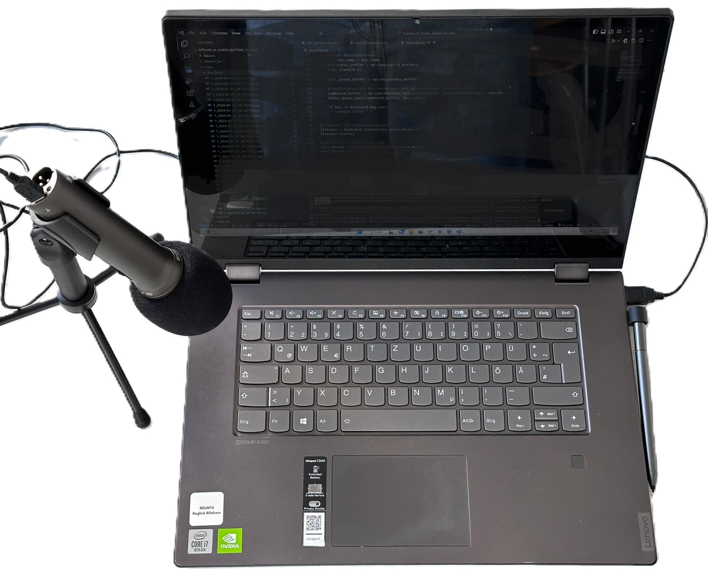

# KI-gesteuerte Erkennung von Tastaturanschlägen

## Motivation

In einer Welt, in der Technologie und digitale Kommunikation immer mehr an Bedeutung gewinnen, wird die Möglichkeit, Tastenanschläge allein durch ihr Klangprofil zu identifizieren, als eine faszinierende technologische Errungenschaft betrachtet. Diese Fähigkeit birgt jedoch nicht nur innovative Anwendungsmöglichkeiten, sondern auch ernsthafte Sicherheitsrisiken. Insbesondere könnte eine Technologie zur akustischen Erkennung von Tastaturgeräuschen für Personen, die ihre Arbeit und Interaktionen häufig in digitalen Live-Streams oder in öffentlichen Räumen teilen, eine signifikante Bedrohung darstellen. Die potenzielle Gefahr, dass sensible Informationen – sei es durch Passwörter, private Nachrichten oder vertrauliche Daten – durch einfaches Abhören von Tastenanschlägen kompromittiert werden könnten, erfordert besondere Aufmerksamkeit.

Die subtilen Unterschiede in den Klangprofilen verschiedener Tastaturen oder spezifischer Tastenanschläge bleiben für das menschliche Ohr oftmals ununterscheidbar, doch der Fortschritt in der künstlichen Intelligenz und in spezialisierten Algorithmen zur Klassifizierung ermöglicht die Realisierung einer solchen Technologie. Die Kombination aus leistungsfähigen, tiefen Lernmodellen und fortschrittlichen Techniken in Computer Vision und -audition eröffnet neue Wege für die präzise akustische Analyse und Interpretation.

## Überblick

In diesem Projekt wird die Grenze der Künstlichen Intelligenz in der Erkennung von Tastaturanschlägen auf Basis ihres Klangprofils ausgelotet. Mit dem Einsatz fortschrittlicher Technologien wie TensorFlow-Keras für das Training tiefer neuronaler Netzwerke wird beabsichtigt, ein hochentwickeltes Modell zu kreieren, das fähig ist, selbst minimale akustische Differenzen zwischen verschiedenen Tastenanschlägen präzise zu identifizieren. Das Vorhaben konzentriert sich auf die Entwicklung eines leistungsfähigen Systems, das die nuancierten Unterschiede im Klang von Tasten wie "1", "2", oder "Enter" genau unterscheiden kann, um die Machbarkeit und Effektivität der KI-gesteuerten Erkennung von Tastaturanschlägen zu demonstrieren.

## Aufzeichnung

Um eine hohe Datenqualität für die KI-basierte Erkennung von Tastaturanschlägen zu gewährleisten, verwenden wir ein Samson Q2U Mikrofon für die Audioaufnahmen. Die Aufnahmen werden mit einer Lenovo MT 81 TL Tastatur durchgeführt, wobei eine Abtastrate von 44100 Hz genutzt wird. Jedes aufgezeichnete Sample ist eine Sekunde lang und enthält einen Tastenanschlag bei der halben Sekunde.

### Recording Setup:



## Daten

Die Datenerfassung erfolgt durch eine Python-Anwendung, die Tastenanschläge aufzeichnet und sofort mit einem Label versieht. Das Labeling erfolgt durch die Benennung der Dateien mit den Anfangsbuchstaben der jeweiligen Taste. Anschließend werden die Dateien mittels einer weiteren Funktion entsprechend ihres Labels in einer strukturierten Ordnerhierarchie abgelegt. Die aufgezeichneten Daten sind jeweils eine Sekunde lang und repräsentieren einzelne Tastenanschläge. Aufgrund des hohen Zeitaufwands der Datenaufzeichnung und der Vielzahl an Tasten auf einer Standardtastatur (circa 105) wäre für eine umfassende Datensammlung mit nur 200 Samples pro Taste ein Datenvolumen von etwa 21.000 Aufzeichnungen erforderlich. Ziel dieses Projekts war es daher, einen Proof of Concept zu liefern, wobei lediglich die Tasten '1', '6', 'Shift', 'Space' und 'Enter' für die Auswertung und Datenaufzeichnung berücksichtigt wurden. Um Overfitting entgegenzuwirken, wurden die Daten an verschiedenen Orten und unter variierenden Bedingungen aufgezeichnet, einschließlich unterschiedlicher Hintergrundgeräusche, Mikrofonpositionen, Tastendruckgeschwindigkeiten und Anschlagsdynamiken. Die Aufzeichnungen fanden sowohl in ruhigen Umgebungen als auch in geräuschintensiveren Bereichen statt.

```.
├── README.md
├── model/                     # Ordner für das exportierte KI-Modell
├── src/                       # Skript für die Audioaufnahme
|    ├── order_classifier.py
|    └── recorder.py
└── data/                      # Gesammelte Audiodaten
    ├── Taste1/
    ├── Taste2/
    └── ...
```

## Auswertung

Verschiedene Modelle wurden eingesetzt, um das optimale neuronale Netzwerkmodell für die präzise Erkennung von Tastaturanschlägen zu identifizieren. Zur Überwachung und Analyse des Trainingsfortschritts sowie der Leistung der Modelle wurden die Entwicklertools von [Weights & Biases](https://wandb.ai/site) verwendet. Diese Plattform ermöglichte den effektiven Vergleich der Leistung verschiedener Modelle, wodurch das leistungsfähigste Modell für unsere Anwendung ausgewählt werden konnte.


## Architekturauswahl
